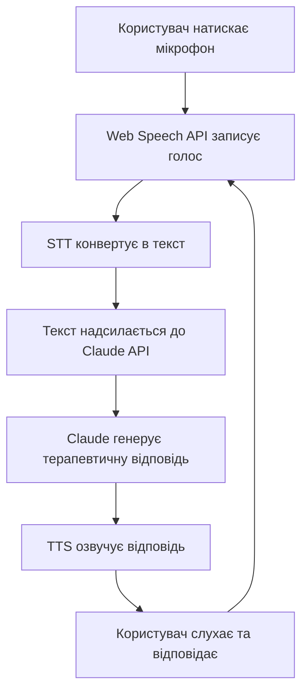
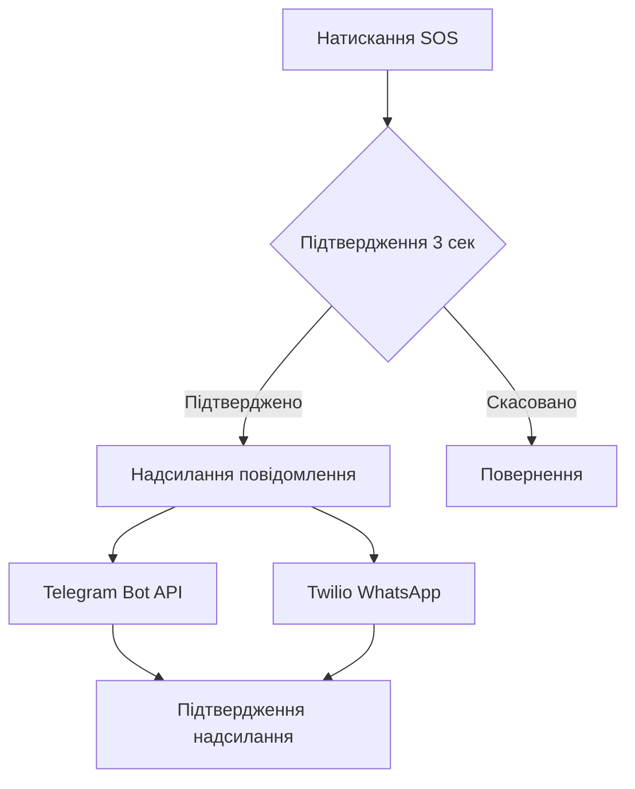
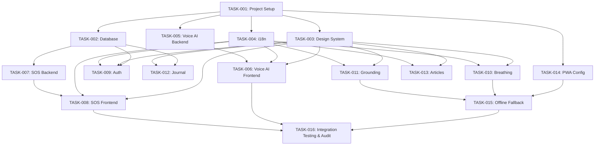

# PRD: PanicAttack Helper

Generated: 2026-02-15
Version: 1.0

## Table of Contents

1. [Project Overview](#1-project-overview)
2. [Technical Interpretation](#2-technical-interpretation)
3. [Functional Specifications](#3-functional-specifications)
4. [Technical Requirements & Constraints](#4-technical-requirements--constraints)
5. [User Stories with Acceptance Criteria](#5-user-stories-with-acceptance-criteria)
6. [Task Breakdown Structure](#6-task-breakdown-structure)
7. [Dependencies & Integration Points](#7-dependencies--integration-points)
8. [Risk Assessment & Mitigation](#8-risk-assessment--mitigation)
9. [Testing & Validation Requirements](#9-testing--validation-requirements)
10. [Success Metrics & Definition of Done](#10-success-metrics--definition-of-done)
11. [Technical Debt & Future Considerations](#11-technical-debt--future-considerations)
12. [Appendices](#12-appendices)

---

## 1. Project Overview

### 1.1 Problem Statement

Панічні атаки вражають мільйони людей з діагностованим тривожним розладом. Під час панічної атаки людина часто не може сама собі допомогти: руки тремтять, важко читати текст, потрібна негайна підтримка. Існуючі рішення — або платні, або вимагають складних налаштувань, або не працюють українською мовою.

### 1.2 Solution

**PanicAttack Helper** — безкоштовний веб-застосунок (PWA) з голосовим AI-асистентом, який проводить людину через панічну атаку використовуючи evidence-based техніки (CBT, grounding, дихальні вправи). Включає SOS-кнопку для миттєвого повідомлення близьких через Telegram та WhatsApp.

### 1.3 Strategic Context

| Parameter | Value |
|---|---|
| **Project Type** | Pet project / навчальний проект (vibe coding) |
| **Business Model** | Безкоштовно |
| **Target Users** | Люди з діагностованим тривожним розладом |
| **Platform** | Web (PWA) |
| **Languages** | Українська (основна), English (secondary) |
| **Team** | Solo developer |
| **Budget** | $0 (free tier services only) |
| **Hosting** | Vercel (Free Hobby Plan) |
| **Implementation** | Claude Code |

---

## 2. Technical Interpretation

### 2.1 Business to Technical Translation

| Business Requirement | Technical Implementation |
|---|---|
| Голосовий асистент розмовляє з користувачем | Web Speech API (STT) → Anthropic Claude API (LLM) → Web Speech API (TTS) |
| SOS-кнопка надсилає повідомлення близьким | Telegram Bot API + Twilio WhatsApp Sandbox → Next.js API Routes |
| Дихальні вправи з анімацією | React анімації (Framer Motion) + Audio API |
| Grounding техніка 5-4-3-2-1 | Інтерактивний покроковий UI з голосовим супроводом |
| Щоденник тривоги | Supabase PostgreSQL + localStorage fallback |
| Бібліотека матеріалів | MDX статичний контент + Supabase |
| Працює офлайн | PWA Service Worker, кеш статичного контенту |
| Опціональна авторизація | Supabase Auth (Email + Google OAuth) |

### 2.2 Recommended Technology Stack

#### Frontend
- **Framework**: Next.js 15 (App Router) + TypeScript
- **Styling**: Tailwind CSS 4
- **UI Components**: shadcn/ui (accessible, customizable)
- **Animations**: Framer Motion (breathing exercises, transitions)
- **PWA**: Serwist (Service Worker, offline caching) — replaces deprecated next-pwa
- **i18n**: next-intl (Ukrainian + English)
- **State Management**: Zustand (lightweight, simple)

#### Backend (Serverless)
- **API**: Next.js API Routes (Vercel Serverless Functions)
- **Database**: Supabase (PostgreSQL, free tier: 500MB, 50K monthly active users)
- **Auth**: Supabase Auth (Email, Google OAuth)
- **File Storage**: Supabase Storage (for audio, if needed)

#### Voice AI Pipeline
- **Speech-to-Text**: Web Speech API (SpeechRecognition) — free, browser built-in, Ukrainian supported in Chrome/Edge
- **LLM Processing**: Anthropic Claude API (claude-sonnet model) — fast, affordable, excellent at empathetic conversation
- **Text-to-Speech**: Web Speech API (SpeechSynthesis) — free, browser built-in

#### SOS Messaging
- **Telegram**: Telegram Bot API (100% free, reliable)
- **WhatsApp**: Twilio WhatsApp Sandbox (free for development/testing)

#### DevOps
- **Hosting**: Vercel (Free Hobby Plan)
- **CI/CD**: Vercel auto-deploy from GitHub
- **Version Control**: GitHub (this repository)

### 2.3 Architecture Diagram

```
┌─────────────────────────────────────────────────────┐
│                    CLIENT (PWA)                       │
│                                                       │
│  ┌──────────┐  ┌───────────┐  ┌──────────────────┐  │
│  │  Voice    │  │ Breathing │  │  Grounding       │  │
│  │  Chat UI  │  │ Exercises │  │  5-4-3-2-1       │  │
│  └────┬─────┘  └───────────┘  └──────────────────┘  │
│       │                                               │
│  ┌────┴─────┐  ┌───────────┐  ┌──────────────────┐  │
│  │  SOS     │  │  Anxiety  │  │  Articles /      │  │
│  │  Button  │  │  Journal  │  │  Tips Library     │  │
│  └────┬─────┘  └─────┬─────┘  └──────────────────┘  │
│       │               │                               │
│  ┌────┴───────────────┴──────────────────────────┐   │
│  │         Service Worker (Offline Cache)         │   │
│  └───────────────────────────────────────────────┘   │
└──────────────────────┬────────────────────────────────┘
                       │ HTTPS
┌──────────────────────┴────────────────────────────────┐
│              VERCEL SERVERLESS FUNCTIONS               │
│                                                        │
│  ┌──────────────┐  ┌─────────────┐  ┌──────────────┐ │
│  │ /api/chat    │  │ /api/sos    │  │ /api/journal │ │
│  │ (Voice AI)   │  │ (Messaging) │  │ (CRUD)       │ │
│  └──────┬───────┘  └──────┬──────┘  └──────┬───────┘ │
└─────────┼──────────────────┼────────────────┼─────────┘
          │                  │                │
  ┌───────┴───────┐  ┌──────┴──────────┐  ┌──┴──────────┐
  │ Anthropic     │  │ Telegram Bot API│  │ Supabase    │
  │ Claude API    │  │ Twilio WhatsApp │  │ (DB + Auth) │
  └───────────────┘  └─────────────────┘  └─────────────┘
```

---

## 3. Functional Specifications

### 3.1 Core Features

#### F-001: Voice AI Assistant (P0 — Critical)

**Description**: Голосовий асистент, який веде користувача через панічну атаку. Користувач говорить голосом, AI відповідає голосом. Заснований на evidence-based протоколах (CBT, grounding techniques).

**User Flow**:


**Behavior**:
- При першому відкритті — привітання і пропозиція допомоги
- Розпізнає стан паніки та адаптує відповідь
- Використовує техніки: дихальні вправи, progressive muscle relaxation, cognitive reframing, grounding
- Говорить спокійним, підтримуючим тоном
- Може запропонувати перейти до конкретної вправи (дихальна, grounding)
- Зберігає контекст розмови протягом сесії

**AI System Prompt (Core Knowledge)**:
- CBT (Cognitive Behavioral Therapy) техніки для панічних атак
- Grounding techniques (5-4-3-2-1)
- Breathing exercises (4-7-8, box breathing, diaphragmatic)
- Progressive Muscle Relaxation
- Mindfulness-based stress reduction
- Psychoeducation про фізіологію панічної атаки

**Edge Cases**:
- Браузер не підтримує Web Speech API → fallback на текстовий чат
- Поганий мікрофон / шум → повідомлення + текстовий fallback
- Немає інтернету → офлайн-скрипт з базовими інструкціями
- Користувач говорить про суїцид → redirect на гарячу лінію (7333 — Лайфлайн Україна)

**Error Scenarios**:
- Claude API timeout → повторна спроба + повідомлення "Зачекайте, будь ласка"
- STT не розпізнав → "Перепрошую, не розчув. Спробуйте ще раз"
- TTS недоступний → показати текстову відповідь на екрані

---

#### F-002: SOS Button (P0 — Critical)

**Description**: Велика помітна кнопка, одним натисканням якої надсилається заздалегідь налаштоване повідомлення екстреним контактам через Telegram та/або WhatsApp.

**User Flow**:


**Behavior**:
- Кнопка завжди видима на кожному екрані (fixed position)
- Натискання → 3-секундний countdown для підтвердження (запобігає випадковому натисканню)
- Повторне натискання або утримання → миттєве надсилання
- Повідомлення включає: ім'я користувача, "У мене панічна атака, мені потрібна підтримка", опціонально — геолокація
- Після надсилання — підтвердження на екрані + вібрація

**Setup Flow**:
1. Користувач додає контакти (ім'я + Telegram username та/або номер WhatsApp)
2. Для Telegram:
   - Додаток генерує унікальний `link_token` для кожного контакту
   - Показує deep link: `t.me/{BOT_USERNAME}?start={link_token}`
   - Контакт натискає link → надсилає `/start {link_token}` боту
   - Bot webhook (`/api/telegram/webhook`) отримує `chat_id` + `link_token`
   - Сервер зберігає `telegram_chat_id` для цього контакту
   - UI показує статус: "Очікує підключення" → "Підключено"
3. Для WhatsApp: верифікація номера через Twilio sandbox
4. Тестове повідомлення для перевірки

**Security**:
- SOS endpoint захищений per-device token (генерується при першому налаштуванні, зберігається в localStorage/Supabase)
- Rate limit: максимум 5 SOS запитів за 10 хвилин на токен
- Контакти не передаються в request body — endpoint отримує їх з localStorage token mapping або Supabase по user_id

**Edge Cases**:
- Немає налаштованих контактів → prompt до налаштувань
- Telegram бот заблокований контактом → повідомлення про помилку
- Контакт не натиснув deep link → статус "Очікує підключення", SOS не може бути надіслано цьому контакту
- Немає інтернету → черга повідомлень, надсилання при відновленні з'єднання
- WhatsApp sandbox expired → fallback на Telegram only

---

#### F-003: Breathing Exercises (P1 — Important)

**Description**: Анімовані дихальні вправи з візуальним гідом та звуковим супроводом.

**Exercises**:
1. **Box Breathing (4-4-4-4)**: Вдих 4с → Затримка 4с → Видих 4с → Затримка 4с
2. **4-7-8 Technique**: Вдих 4с → Затримка 7с → Видих 8с
3. **Diaphragmatic Breathing**: Повільний вдих 5с → Видих 5с
4. **Physiological Sigh (1-1-6)**: Короткий вдих 1с → Додатковий вдих 1с → Довгий видих 6с

**UI**:
- Анімоване коло/фігура що розширюється/стискається
- Кольорова індикація фази (вдих = блакитний, затримка = фіолетовий, видих = зелений)
- Таймер поточної фази
- Лічильник циклів (рекомендовано 5-10 циклів)
- Звуковий супровід (опціональний): м'який тон або природні звуки
- Хаптичний feedback (вібрація на мобільному)

**Offline**: Повністю працює офлайн (PWA cache).

---

#### F-004: Grounding Technique 5-4-3-2-1 (P1 — Important)

**Description**: Інтерактивна покрокова техніка заземлення що використовує 5 відчуттів.

**Steps**:
1. **5 речей, які бачиш** — користувач називає/вибирає
2. **4 речі, які можеш торкнутися** — тактильний фокус
3. **3 звуки, які чуєш** — аудіальний фокус
4. **2 запахи** — нюховий фокус
5. **1 смак** — смаковий фокус

**UI**:
- Покроковий wizard з великим текстом
- Можливість відповідати голосом або натисканням
- Візуальний прогрес-бар
- Підбадьорюючі повідомлення між кроками
- Заспокійливі кольори та анімації

**Offline**: Повністю працює офлайн.

---

#### F-005: Anxiety Journal (P2 — Nice to Have)

**Description**: Щоденник для відстеження панічних атак, тригерів, та прогресу.

**Data Model**:
```typescript
interface JournalEntry {
  id: string;
  user_id?: string;            // if authenticated
  anxiety_level: number;       // 1-10 scale
  triggers: string[];          // predefined + custom
  symptoms: string[];          // predefined list
  coping_techniques: string[]; // which techniques helped
  duration_minutes: number;    // minutes
  notes: string;               // free text
  created_at: Date;
}
```

**Features**:
- Швидке логування (мінімум полів для заповнення під час/після атаки)
- Передвизначені тригери та симптоми (швидкий вибір)
- Графіки та тренди (частота, рівень тривоги за тиждень/місяць)
- Експорт даних (JSON/CSV для показу терапевту)

**Storage**:
- Без авторизації: localStorage (дані лише на пристрої)
- З авторизацією: Supabase PostgreSQL (синхронізація між пристроями)

---

#### F-006: Articles & Tips Library (P2 — Nice to Have)

**Description**: Бібліотека evidence-based матеріалів про панічні атаки та управління тривогою.

**Content Categories**:
- Що таке панічна атака (психоедукація)
- CBT техніки для самодопомоги
- Grounding та mindfulness
- Як підтримати близьку людину з тривожним розладом
- Коли звертатися до спеціаліста
- Медикаментозне лікування (загальна інформація)

**Implementation**:
- MDX файли у репозиторії (статичний контент)
- Пошук по статтях
- Закладки (збережені статті)
- Українська та англійська версії

**Sources** (відкриті):
- NIMH (National Institute of Mental Health)
- WHO guidelines
- APA (American Psychological Association)
- Cochrane Reviews
- PubMed open access

---

### 3.2 Cross-Cutting Features

#### CF-001: Optional Authentication

- Supabase Auth: Email + Password, Google OAuth
- Без авторизації — повний доступ до всіх функцій, дані в localStorage
- З авторизацією — синхронізація контактів, журналу, налаштувань між пристроями

#### CF-002: PWA & Offline Support

- Service Worker кешує: UI, дихальні вправи, grounding, статті
- Офлайн fallback для голосового асистента: текстовий скрипт з базовими інструкціями
- SOS повідомлення ставляться в чергу при офлайні
- App manifest для "Add to Home Screen"

#### CF-003: Internationalization (i18n)

- Українська (uk) — основна
- English (en) — додаткова
- next-intl для перекладів
- Мова AI-асистента відповідає мові інтерфейсу

#### CF-004: Accessibility (a11y)

- WCAG 2.1 AA compliance
- Великі кнопки (мінімум 48x48px tap targets)
- Контрастні кольори, читабельні шрифти
- Screen reader support
- Keyboard navigation
- Зменшення руху (prefers-reduced-motion)

#### CF-005: Design System

- **Колірна палітра**: заспокійливі тони — м'який блакитний, лавандовий, теплий білий, ніжний зелений
- **Типографіка**: крупний, легко читабельний шрифт (мінімум 16px body, 24px+ для контенту під час атаки)
- **Spacing**: щедрі відступи, "повітря" в дизайні
- **Стан паніки**: спрощений UI, мінімум елементів, максимум контрасту

---

## 4. Technical Requirements & Constraints

### 4.1 Performance Requirements

| Metric | Target |
|---|---|
| First Contentful Paint | < 1.5s |
| Largest Contentful Paint | < 2.5s |
| Time to Interactive | < 3s |
| Voice response latency (STT → LLM → TTS) | < 3s |
| SOS message delivery | < 5s |
| Lighthouse Performance Score | > 90 |
| Lighthouse Accessibility Score | > 95 |

### 4.2 Security Requirements

- HTTPS only (Vercel provides by default)
- API keys stored in environment variables (Vercel secrets)
- Rate limiting on API routes (Vercel middleware)
- Supabase Row Level Security (RLS) for user data
- No PHI/PII stored without user consent
- CORS restricted to own domain
- Input sanitization on all API endpoints
- CSP headers configured

### 4.3 Browser Support

| Browser | Minimum Version | Web Speech API |
|---|---|---|
| Chrome | 90+ | Full support (STT + TTS) |
| Edge | 90+ | Full support |
| Safari | 15+ | TTS only (STT limited) |
| Firefox | 100+ | TTS only (no STT) |

**Fallback**: For browsers without STT support — text input mode.

### 4.4 Data Models

#### Supabase Tables (server-side, with auth)
```typescript
interface Profile {
  id: string;              // UUID, references auth.users(id)
  display_name: string;
  language: 'uk' | 'en';
  created_at: Date;
  updated_at: Date;        // auto-updated via trigger
}

interface EmergencyContact {
  id: string;
  user_id: string;
  name: string;
  telegram_chat_id?: string;
  telegram_username?: string;
  whatsapp_number?: string;
  is_active: boolean;
  created_at: Date;
  updated_at: Date;
}

interface JournalEntry {
  id: string;
  user_id: string;
  anxiety_level: number;       // 1-10
  triggers: string[];
  symptoms: string[];
  coping_techniques: string[];
  duration_minutes: number;
  notes: string;
  created_at: Date;
}
```

#### Client-side only (in-memory + localStorage)
```typescript
// Chat sessions are NOT stored in Supabase — kept client-side per session.
// Conversation history is maintained in React state (Zustand store)
// and optionally persisted to localStorage for session recovery.
interface ChatSession {
  id: string;
  messages: ChatMessage[];
  language: 'uk' | 'en';
  started_at: Date;
}

interface ChatMessage {
  role: 'user' | 'assistant';
  content: string;
  timestamp: Date;
}
```

#### localStorage Schema (without auth mode)
```typescript
// Key format: "panic-helper:{entity}"
// All values are JSON-serialized arrays/objects

"panic-helper:contacts"   → EmergencyContact[]   // same shape as DB model, without user_id
"panic-helper:journal"    → JournalEntry[]        // same shape as DB model, without user_id
"panic-helper:settings"   → { language: 'uk'|'en', userName: string }
"panic-helper:chat"       → ChatSession | null    // current/last session for recovery
"panic-helper:sos-queue"  → SOSQueueItem[]        // offline SOS messages pending delivery
"panic-helper:version"    → number                // schema version for future migrations
```

### 4.5 API Contracts

#### Error Response Format (all endpoints)
```typescript
// All error responses follow this shape:
interface APIError {
  error: {
    code: string;       // machine-readable, e.g. "RATE_LIMIT_EXCEEDED"
    message: string;    // human-readable (localized)
  }
}
```

#### Voice Chat
```yaml
POST /api/chat
  Headers:
    Content-Type: application/json
  Request Body:
    message: string (required, max 500 chars)
    sessionId: string (optional — omit for new session)
    language: 'uk' | 'en'
    history: ChatMessage[] (optional, max 20 messages — client sends context window)
  Response 200:
    reply: string
    sessionId: string
  Response 429: { error: { code: "RATE_LIMIT_EXCEEDED", message: "..." } }
  Response 500: { error: { code: "LLM_ERROR", message: "..." } }

  Rate Limits:
    - Max 30 messages per session
    - Max 10 sessions per hour per IP
    - Max input tokens per request: 1000
    - Max output tokens per response: 300 (short responses during panic)
```

#### SOS Send
```yaml
POST /api/sos
  Headers:
    Content-Type: application/json
    X-Device-Token: string (required — per-device auth token)
  Request Body:
    location?: { lat: number, lng: number }
  Response 200:
    results: { contactId: string, channel: string, status: 'sent' | 'failed', error?: string }[]
  Response 400: { error: { code: "NO_CONTACTS", message: "..." } }
  Response 401: { error: { code: "INVALID_TOKEN", message: "..." } }
  Response 429: { error: { code: "RATE_LIMIT_EXCEEDED", message: "..." } }

  Rate Limits:
    - Max 5 SOS requests per 10 minutes per device token

  Note: contacts are resolved server-side from device token mapping
  (localStorage mode) or from Supabase by user_id (auth mode).
  Contacts are NEVER passed in request body.
```

#### Telegram Webhook (bot callback)
```yaml
POST /api/telegram/webhook
  Headers:
    X-Telegram-Bot-Api-Secret-Token: string (Telegram webhook secret)
  Request Body:
    Telegram Update object (from Telegram servers)
  Response 200: { ok: true }

  Behavior:
    - Parses /start {link_token} commands
    - Maps link_token → contact, saves telegram_chat_id
    - Sends confirmation message to contact
```

#### Journal CRUD (requires auth OR device token)
```yaml
GET    /api/journal              → JournalEntry[]
POST   /api/journal              → JournalEntry
PUT    /api/journal/[id]         → JournalEntry
DELETE /api/journal/[id]         → void

  Files: app/api/journal/route.ts + app/api/journal/[id]/route.ts
```

#### Emergency Contacts CRUD (requires auth OR device token)
```yaml
GET    /api/contacts             → EmergencyContact[]
POST   /api/contacts             → EmergencyContact
PUT    /api/contacts/[id]        → EmergencyContact
DELETE /api/contacts/[id]        → void

  Files: app/api/contacts/route.ts + app/api/contacts/[id]/route.ts
```

---

## 5. User Stories with Acceptance Criteria

### USR-001: Voice Conversation During Panic Attack (P0)

**As a** person experiencing a panic attack
**I want to** talk to an AI assistant by voice
**So that** I receive calming guidance without needing to type

**Acceptance Criteria**:
- [ ] User can activate voice input by pressing a microphone button
- [ ] Speech is converted to text in Ukrainian or English
- [ ] AI responds with calming, evidence-based guidance
- [ ] AI response is spoken aloud via TTS
- [ ] Conversation context is maintained within a session
- [ ] Fallback to text input if STT is unavailable
- [ ] Response latency < 3 seconds
- [ ] AI never gives medical diagnoses or prescribes medication
- [ ] Suicidal mentions redirect to crisis hotline

### USR-002: SOS Alert (P0)

**As a** person in distress
**I want to** press one button to alert my emergency contacts
**So that** my close ones know I need support

**Acceptance Criteria**:
- [ ] SOS button is visible on every screen
- [ ] Single press + 3s confirmation sends message
- [ ] Long press sends immediately
- [ ] Message sent via configured channels (Telegram/WhatsApp)
- [ ] Delivery confirmation shown to user
- [ ] Works when contacts are stored in localStorage (no auth required)
- [ ] Queues message if offline, sends when back online

### USR-003: Breathing Exercise (P1)

**As a** person with anxiety
**I want to** follow guided breathing exercises
**So that** I can reduce my anxiety through controlled breathing

**Acceptance Criteria**:
- [ ] At least 4 breathing techniques available
- [ ] Animated visual guide (expanding/contracting circle)
- [ ] Phase indicators (inhale/hold/exhale) with timers
- [ ] Optional audio cues
- [ ] Cycle counter
- [ ] Works fully offline
- [ ] Accessible (screen reader, reduced motion)

### USR-004: Grounding Exercise (P1)

**As a** person experiencing depersonalization during panic
**I want to** be guided through the 5-4-3-2-1 grounding technique
**So that** I can reconnect with my surroundings

**Acceptance Criteria**:
- [ ] Step-by-step wizard with large, readable text
- [ ] Voice input or tap to proceed
- [ ] Progress bar across all 5 steps
- [ ] Encouraging messages between steps
- [ ] Works fully offline

### USR-005: Anxiety Journal (P2)

**As a** person managing anxiety long-term
**I want to** log my panic attacks and triggers
**So that** I can track patterns and share data with my therapist

**Acceptance Criteria**:
- [ ] Quick-log form (< 30 seconds to fill)
- [ ] Predefined triggers and symptoms for fast selection
- [ ] Anxiety level scale (1-10)
- [ ] History view with basic charts (frequency, severity)
- [ ] Export to CSV/JSON
- [ ] Data in localStorage without auth, Supabase with auth

### USR-006: Educational Content (P2)

**As a** person recently diagnosed with anxiety disorder
**I want to** read evidence-based information about panic attacks
**So that** I understand my condition and learn coping strategies

**Acceptance Criteria**:
- [ ] Articles available in Ukrainian and English
- [ ] Search functionality
- [ ] Bookmark articles for later
- [ ] Sources cited for each article
- [ ] Available offline (cached via PWA)

---

## 6. Task Breakdown Structure

### Phase 1: Foundation

#### TASK-001: Project Setup & Configuration
**Type**: DevOps / Setup
**Dependencies**: None

**Files to create**:
- `package.json` — Next.js 15 project configuration
- `tsconfig.json` — TypeScript configuration
- `tailwind.config.ts` — Tailwind CSS configuration
- `next.config.ts` — Next.js config with PWA, i18n
- `.env.local` — Environment variables template
- `.env.example` — Documented env vars
- `.gitignore` — Standard Next.js gitignore
- `src/app/layout.tsx` — Root layout with providers
- `src/app/page.tsx` — Homepage
- `src/lib/supabase/client.ts` — Supabase browser client
- `src/lib/supabase/server.ts` — Supabase server client

**Commands**:
```bash
npx create-next-app@latest . --typescript --tailwind --eslint --app --src-dir
npx shadcn@latest init
npm install @supabase/supabase-js @supabase/ssr zustand next-intl framer-motion @anthropic-ai/sdk
npm install -D @serwist/next serwist
```

---

#### TASK-002: Supabase Database Setup
**Type**: Database
**Dependencies**: TASK-001

**Files to create**:
- `supabase/migrations/001_create_functions.sql` — update_updated_at(), handle_new_user()
- `supabase/migrations/002_create_profiles.sql` — profiles table + trigger
- `supabase/migrations/003_create_emergency_contacts.sql` — contacts table + trigger + link_token
- `supabase/migrations/004_create_journal_entries.sql` — journal table
- `supabase/migrations/005_create_device_tokens.sql` — device tokens for non-auth SOS
- `supabase/migrations/006_enable_rls.sql` — RLS policies for all tables
- `supabase/seed.sql` — Development seed data

**SQL Schema**:
```sql
-- ============================================
-- Function: auto-update updated_at on row change
-- ============================================
CREATE OR REPLACE FUNCTION update_updated_at()
RETURNS TRIGGER AS $$
BEGIN
    NEW.updated_at = NOW();
    RETURN NEW;
END;
$$ LANGUAGE plpgsql;

-- ============================================
-- Function: auto-create profile on user signup
-- ============================================
CREATE OR REPLACE FUNCTION handle_new_user()
RETURNS TRIGGER AS $$
BEGIN
    INSERT INTO public.profiles (id, display_name, language)
    VALUES (NEW.id, COALESCE(NEW.raw_user_meta_data->>'display_name', ''), 'uk');
    RETURN NEW;
END;
$$ LANGUAGE plpgsql SECURITY DEFINER;

-- Trigger: create profile when auth.users row is inserted
CREATE TRIGGER on_auth_user_created
    AFTER INSERT ON auth.users
    FOR EACH ROW EXECUTE FUNCTION handle_new_user();

-- ============================================
-- Tables
-- ============================================

-- User profiles (extends Supabase Auth)
CREATE TABLE profiles (
    id UUID PRIMARY KEY REFERENCES auth.users(id) ON DELETE CASCADE,
    display_name TEXT,
    language TEXT DEFAULT 'uk' CHECK (language IN ('uk', 'en')),
    created_at TIMESTAMPTZ DEFAULT NOW(),
    updated_at TIMESTAMPTZ DEFAULT NOW()
);

CREATE TRIGGER profiles_updated_at
    BEFORE UPDATE ON profiles
    FOR EACH ROW EXECUTE FUNCTION update_updated_at();

-- Emergency contacts
CREATE TABLE emergency_contacts (
    id UUID PRIMARY KEY DEFAULT gen_random_uuid(),
    user_id UUID REFERENCES profiles(id) ON DELETE CASCADE,
    name TEXT NOT NULL,
    telegram_chat_id TEXT,
    telegram_username TEXT,
    telegram_link_token TEXT UNIQUE,  -- for deep link onboarding
    whatsapp_number TEXT,
    is_active BOOLEAN DEFAULT true,
    created_at TIMESTAMPTZ DEFAULT NOW(),
    updated_at TIMESTAMPTZ DEFAULT NOW()
);

CREATE TRIGGER contacts_updated_at
    BEFORE UPDATE ON emergency_contacts
    FOR EACH ROW EXECUTE FUNCTION update_updated_at();

-- Journal entries
CREATE TABLE journal_entries (
    id UUID PRIMARY KEY DEFAULT gen_random_uuid(),
    user_id UUID REFERENCES profiles(id) ON DELETE CASCADE,
    anxiety_level INTEGER CHECK (anxiety_level BETWEEN 1 AND 10),
    triggers TEXT[] DEFAULT '{}',
    symptoms TEXT[] DEFAULT '{}',
    coping_techniques TEXT[] DEFAULT '{}',
    duration_minutes INTEGER,
    notes TEXT,
    created_at TIMESTAMPTZ DEFAULT NOW()
);

-- Device tokens (for unauthenticated SOS)
CREATE TABLE device_tokens (
    id UUID PRIMARY KEY DEFAULT gen_random_uuid(),
    token TEXT UNIQUE NOT NULL,
    contacts JSONB DEFAULT '[]',   -- contacts for non-auth mode
    created_at TIMESTAMPTZ DEFAULT NOW()
);

-- ============================================
-- Row Level Security
-- ============================================
ALTER TABLE profiles ENABLE ROW LEVEL SECURITY;
ALTER TABLE emergency_contacts ENABLE ROW LEVEL SECURITY;
ALTER TABLE journal_entries ENABLE ROW LEVEL SECURITY;
ALTER TABLE device_tokens ENABLE ROW LEVEL SECURITY;

CREATE POLICY "Users can view own profile" ON profiles FOR SELECT USING (auth.uid() = id);
CREATE POLICY "Users can update own profile" ON profiles FOR UPDATE USING (auth.uid() = id);
CREATE POLICY "Users can manage own contacts" ON emergency_contacts FOR ALL USING (auth.uid() = user_id);
CREATE POLICY "Users can manage own journal" ON journal_entries FOR ALL USING (auth.uid() = user_id);
-- device_tokens accessed only via service_role key in API routes (no RLS policy for anon)
```

---

#### TASK-003: Design System & Layout
**Type**: Frontend
**Dependencies**: TASK-001

**Files to create**:
- `src/app/globals.css` — Global styles, CSS variables, calming palette
- `src/components/ui/` — shadcn/ui components (button, card, dialog, input, etc.)
- `src/components/layout/Header.tsx` — Navigation header
- `src/components/layout/BottomNav.tsx` — Mobile bottom navigation
- `src/components/layout/SOSButton.tsx` — Fixed SOS button (always visible)
- `src/components/layout/AppShell.tsx` — Main layout wrapper
- `src/lib/fonts.ts` — Font configuration (Inter or similar)

**Design Tokens**:
```css
:root {
  --color-calm-blue: #7CB9E8;
  --color-lavender: #B4A7D6;
  --color-warm-white: #FAF9F6;
  --color-soft-green: #A8D5BA;
  --color-text-primary: #2D3748;
  --color-danger: #E53E3E;
  --color-sos-red: #DC2626;
}
```

---

#### TASK-004: i18n Setup (Ukrainian + English)
**Type**: Frontend
**Dependencies**: TASK-001

**Files to create**:
- `src/i18n/request.ts` — next-intl configuration
- `src/i18n/routing.ts` — Locale routing
- `messages/uk.json` — Ukrainian translations
- `messages/en.json` — English translations
- `src/middleware.ts` — Composable middleware (locale detection; auth will be added in TASK-009)

**Note**: middleware.ts must be designed as composable from the start — TASK-009 (Auth) will extend it with auth checks. Use a chain/compose pattern so both locale and auth logic coexist in a single Next.js middleware file.

---

### Phase 2: Core Features

#### TASK-005: Voice AI Chat — Backend
**Type**: Backend
**Dependencies**: TASK-001

**Files to create**:
- `src/app/api/chat/route.ts` — Chat API endpoint
- `src/lib/ai/system-prompt.ts` — Claude system prompt with CBT/grounding knowledge
- `src/lib/ai/chat-service.ts` — Anthropic API integration
- `src/lib/ai/safety-filter.ts` — Crisis detection & redirection logic

**Implementation**:
```typescript
// system-prompt.ts — Core knowledge base
export const SYSTEM_PROMPT = `
You are a compassionate mental health support assistant specialized in
helping people during panic attacks. You use evidence-based techniques:

1. Psychoeducation: Explain that panic attacks are not dangerous
2. Breathing exercises: Guide 4-7-8, box breathing
3. Grounding: 5-4-3-2-1 technique
4. Cognitive reframing: Challenge catastrophic thoughts
5. Progressive muscle relaxation

RULES:
- Never diagnose or prescribe medication
- Always validate emotions first, then offer techniques
- Keep responses SHORT (2-3 sentences max during acute panic)
- If user mentions suicide/self-harm, provide crisis hotline: 7333 (Лайфлайн Україна)
- Speak in the user's language (Ukrainian or English)
- Use a warm, calm, supportive tone
`;
```

---

#### TASK-006: Voice AI Chat — Frontend
**Type**: Frontend
**Dependencies**: TASK-003, TASK-005

**Files to create**:
- `src/app/chat/page.tsx` — Voice chat page
- `src/components/chat/VoiceChat.tsx` — Main voice chat component
- `src/components/chat/ChatBubble.tsx` — Message display
- `src/components/chat/VoiceButton.tsx` — Push-to-talk / toggle mic
- `src/hooks/useSpeechRecognition.ts` — Web Speech API STT hook
- `src/hooks/useSpeechSynthesis.ts` — Web Speech API TTS hook
- `src/hooks/useChat.ts` — Chat state management

---

#### TASK-007: SOS Button — Backend
**Type**: Backend
**Dependencies**: TASK-001, TASK-002

**Files to create**:
- `src/app/api/sos/route.ts` — SOS send endpoint (resolves contacts server-side)
- `src/app/api/telegram/webhook/route.ts` — Telegram bot webhook for deep link onboarding
- `src/lib/messaging/telegram.ts` — Telegram Bot API client
- `src/lib/messaging/whatsapp.ts` — Twilio WhatsApp client
- `src/lib/messaging/message-template.ts` — SOS message templates (uk/en)
- `src/lib/auth/device-token.ts` — Device token generation & validation

---

#### TASK-008: SOS Button — Frontend
**Type**: Frontend
**Dependencies**: TASK-003, TASK-007

**Files to create**:
- `src/components/sos/SOSButton.tsx` — Global SOS button with countdown
- `src/components/sos/SOSConfirmation.tsx` — Confirmation overlay
- `src/components/sos/SOSSetup.tsx` — Contact setup wizard (includes Telegram deep link flow)
- `src/app/settings/contacts/page.tsx` — Manage emergency contacts
- `src/app/api/contacts/route.ts` — Contacts list + create API
- `src/app/api/contacts/[id]/route.ts` — Contacts update + delete API
- `src/hooks/useSOS.ts` — SOS logic, offline queue
- `src/lib/storage/contacts.ts` — localStorage adapter for contacts

---

#### TASK-009: Authentication (Optional)
**Type**: Full Stack
**Dependencies**: TASK-002, TASK-003, TASK-004

**Files to create**:
- `src/app/auth/login/page.tsx` — Login page
- `src/app/auth/signup/page.tsx` — Sign up page
- `src/app/auth/callback/route.ts` — OAuth callback
- `src/components/auth/AuthForm.tsx` — Reusable auth form
- `src/components/auth/AuthProvider.tsx` — Auth context provider
- `src/hooks/useAuth.ts` — Authentication hook
- `src/middleware.ts` — Update with auth middleware

---

### Phase 3: Additional Features

#### TASK-010: Breathing Exercises
**Type**: Frontend
**Dependencies**: TASK-003

**Files to create**:
- `src/app/exercises/breathing/page.tsx` — Breathing exercises page
- `src/components/exercises/BreathingCircle.tsx` — Animated breathing guide
- `src/components/exercises/BreathingTimer.tsx` — Phase timer
- `src/components/exercises/ExerciseSelector.tsx` — Exercise type picker
- `src/lib/exercises/breathing-patterns.ts` — Exercise configurations
- `src/hooks/useBreathingExercise.ts` — Exercise state machine

---

#### TASK-011: Grounding 5-4-3-2-1
**Type**: Frontend
**Dependencies**: TASK-003

**Files to create**:
- `src/app/exercises/grounding/page.tsx` — Grounding exercise page
- `src/components/exercises/GroundingWizard.tsx` — Step-by-step wizard
- `src/components/exercises/GroundingStep.tsx` — Individual step component
- `src/components/exercises/ProgressBar.tsx` — Visual progress
- `src/hooks/useGroundingExercise.ts` — Exercise state

---

#### TASK-012: Anxiety Journal
**Type**: Full Stack
**Dependencies**: TASK-002, TASK-003

**Files to create**:
- `src/app/journal/page.tsx` — Journal list view
- `src/app/journal/new/page.tsx` — New entry form
- `src/app/journal/[id]/page.tsx` — Entry detail
- `src/components/journal/QuickLogForm.tsx` — Quick-log component
- `src/components/journal/AnxietyChart.tsx` — Trends visualization
- `src/components/journal/TriggerSelector.tsx` — Predefined triggers
- `src/app/api/journal/route.ts` — Journal list + create API
- `src/app/api/journal/[id]/route.ts` — Journal update + delete API
- `src/lib/storage/journal.ts` — localStorage adapter
- `src/hooks/useJournal.ts` — Journal data management

---

#### TASK-013: Articles & Tips Library
**Type**: Frontend / Content
**Dependencies**: TASK-003, TASK-004

**Files to create**:
- `src/app/library/page.tsx` — Articles listing
- `src/app/library/[slug]/page.tsx` — Article detail
- `src/components/library/ArticleCard.tsx` — Article preview card
- `src/components/library/SearchBar.tsx` — Article search
- `content/articles/uk/` — Ukrainian MDX articles
- `content/articles/en/` — English MDX articles
- `src/lib/content/articles.ts` — MDX loading utilities

---

### Phase 4: PWA & Polish

#### TASK-014: PWA Configuration
**Type**: DevOps / Frontend
**Dependencies**: TASK-001

**Files to create**:
- `public/manifest.json` — PWA manifest
- `src/app/sw.ts` — Serwist service worker entry point
- `serwist.config.ts` — Serwist configuration (caching strategies)
- `public/icons/` — App icons (192x192, 512x512, maskable)
- `src/components/pwa/InstallPrompt.tsx` — "Add to Home Screen" prompt
- `src/hooks/useOffline.ts` — Online/offline detection

**Caching Strategy**:
- **Cache First**: Static assets, exercise pages, articles
- **Network First**: API calls, chat
- **Stale While Revalidate**: Article content

---

#### TASK-015: Offline Fallback
**Type**: Frontend
**Dependencies**: TASK-014, TASK-010, TASK-011

**Files to create**:
- `src/app/offline/page.tsx` — Offline fallback page
- `src/components/offline/OfflineBanner.tsx` — "You're offline" notification
- `src/lib/offline/sos-queue.ts` — Queue SOS messages for later delivery
- `src/lib/offline/chat-fallback.ts` — Static calming script for offline use

---

#### TASK-016: Integration Testing & Audit
**Type**: QA
**Dependencies**: TASK-006, TASK-008, TASK-015

**Scope**:
- Playwright E2E tests for all critical user journeys (voice chat, SOS, breathing, grounding)
- Lighthouse CI audit: Performance > 90, Accessibility > 95, PWA = 100
- axe-core accessibility scan on all pages
- Offline scenario testing (disconnect network → exercises work, SOS queues, chat shows fallback)
- Security review: rate limiting verification, CSP headers, RLS policies

**Files to create**:
- `e2e/voice-chat.spec.ts` — Voice chat E2E (mocked STT/TTS)
- `e2e/sos.spec.ts` — SOS flow E2E
- `e2e/breathing.spec.ts` — Breathing exercise E2E
- `e2e/grounding.spec.ts` — Grounding exercise E2E
- `e2e/offline.spec.ts` — Offline fallback scenarios
- `e2e/a11y.spec.ts` — Accessibility audit per page
- `lighthouse.config.js` — Lighthouse CI configuration

---

### Dependency Graph



### Critical Path

The longest dependency chain determines minimum project duration:
```
TASK-001 → TASK-003 → TASK-010 → TASK-015 → TASK-016
TASK-001 → TASK-004 ↗           ↗
TASK-001 → TASK-014 ───────────
```

**Parallelizable streams** (after TASK-001 completes):
- Stream A: TASK-002 → TASK-007 (Database → SOS Backend)
- Stream B: TASK-003 + TASK-004 → TASK-010, TASK-011 (Design + i18n → Exercises)
- Stream C: TASK-005 (Voice AI Backend — independent)
- Stream D: TASK-014 (PWA Config — independent)
- Stream E: TASK-002 + TASK-003 → TASK-009, TASK-012 (DB + Design → Auth + Journal)

**Integration points** (require multiple streams to converge):
- TASK-006: needs Stream B (TASK-003) + Stream C (TASK-005) + TASK-004
- TASK-008: needs Stream B (TASK-003) + Stream A (TASK-007) + TASK-004
- TASK-015: needs Stream B (TASK-010, TASK-011) + Stream D (TASK-014)
- TASK-016: needs all features complete

---

## 7. Dependencies & Integration Points

### 7.1 External Services

| Service | Purpose | Free Tier Limits | Fallback |
|---|---|---|---|
| **Anthropic Claude API** | LLM for voice assistant | Pay-as-you-go (~$3/MTok Sonnet) | Cached responses, offline script |
| **Supabase** | Database + Auth | 500MB DB, 50K MAU, 1GB storage | localStorage |
| **Telegram Bot API** | SOS messages | Unlimited (free) | — |
| **Twilio WhatsApp** | SOS messages | Sandbox (free for dev) | Telegram only |
| **Vercel** | Hosting | 100GB bandwidth, 100h compute | — |

### 7.2 Browser APIs

| API | Purpose | Support |
|---|---|---|
| Web Speech API (Recognition) | Voice input | Chrome, Edge |
| Web Speech API (Synthesis) | Voice output | Chrome, Edge, Safari, Firefox |
| Geolocation API | SOS location sharing | All modern browsers |
| Vibration API | Haptic feedback | Chrome, Edge (Android) |
| Service Worker | Offline/PWA | All modern browsers |
| Web Audio API | Breathing exercise sounds | All modern browsers |

---

## 8. Risk Assessment & Mitigation

| Risk | Probability | Impact | Mitigation |
|---|---|---|---|
| Web Speech API не підтримує українську STT | Medium | High | Fallback на текстовий ввід; тестувати в Chrome (має підтримку) |
| Claude API costs exceed budget | Low | Medium | Rate limiting, кешування відповідей, session limits |
| Twilio WhatsApp sandbox обмеження | High | Medium | Telegram як primary channel, WhatsApp як бонус |
| Користувач у кризі (суїцид) | Low | Critical | Safety filter в AI prompt, автоматичний redirect на гарячу лінію |
| Офлайн під час панічної атаки | Medium | High | PWA cache з дихальними вправами та grounding |
| localStorage cleared | Medium | Low | Попередження про авторизацію для збереження даних |
| Vercel cold start latency | Low | Medium | Edge Runtime для критичних API routes |

---

## 9. Testing & Validation Requirements

### 9.1 Test Strategy

- **Unit Tests**: Vitest + React Testing Library
  - All hooks, services, utilities
  - Component rendering and interaction
  - Coverage target: 70%+

- **E2E Tests**: Playwright
  - Voice chat flow (mocked STT/TTS)
  - SOS button flow
  - Breathing exercise complete cycle
  - Grounding exercise complete cycle
  - Auth flow

- **Accessibility Tests**: axe-core + Lighthouse
  - All pages pass WCAG 2.1 AA
  - Keyboard navigation
  - Screen reader compatibility

- **Performance Tests**: Lighthouse CI
  - Performance score > 90
  - Accessibility score > 95
  - PWA score: 100

### 9.2 Key Test Scenarios

```typescript
// Voice Chat
- Should convert speech to text and send to API
- Should handle STT unavailability gracefully
- Should detect crisis keywords and show hotline
- Should maintain conversation context
- Should work in Ukrainian and English

// SOS
- Should send to all configured contacts
- Should queue messages when offline
- Should require confirmation before sending
- Should handle Telegram/WhatsApp failures independently

// Exercises
- Should complete full breathing cycle with correct timing
- Should progress through all 5 grounding steps
- Should work fully offline
- Should respect prefers-reduced-motion
```

---

## 10. Success Metrics & Definition of Done

### 10.1 MVP Success Criteria

- [ ] Voice assistant responds in Ukrainian and English
- [ ] SOS button sends messages via Telegram
- [ ] At least 2 breathing exercises with animations
- [ ] Grounding 5-4-3-2-1 technique functional
- [ ] PWA installable and works offline (exercises)
- [ ] Lighthouse Performance > 90, Accessibility > 95
- [ ] Deployed on Vercel and accessible via URL

### 10.2 Definition of Done (per task)

- [ ] Code complete and self-reviewed
- [ ] TypeScript — no type errors
- [ ] Responsive (mobile-first)
- [ ] Ukrainian + English translations
- [ ] Accessible (keyboard, screen reader)
- [ ] Works offline where applicable
- [ ] No console errors

---

## 11. Technical Debt & Future Considerations

### 11.1 Post-MVP Enhancements

- **Native mobile app** (React Native or Capacitor)
- **Wearable integration** (heart rate monitoring for auto-detection)
- **Therapist dashboard** (view patient journal with consent)
- **Community features** (anonymous support forum)
- **AI personalization** (learning user's triggers and effective techniques)
- **Multi-language expansion** (Polish, Russian, etc.)
- **Audio therapy sessions** (guided meditations)
- **Emergency services integration** (auto-call 103 in Ukraine)

### 11.2 Known Limitations of MVP

- Web Speech API STT may not work in all browsers
- WhatsApp via Twilio sandbox has limitations (requires recipient opt-in)
- AI responses require internet connection
- No real-time monitoring (no auto-detect panic state)

---

## 12. Appendices

### 12.1 Evidence-Based Sources

| Source | URL | Topics |
|---|---|---|
| NIMH Panic Disorder | https://www.nimh.nih.gov/health/topics/panic-disorder | Overview, treatment |
| APA Anxiety Guidelines | https://www.apa.org/topics/anxiety | CBT, evidence-based treatment |
| WHO Mental Health | https://www.who.int/health-topics/mental-health | Global guidelines |
| Cochrane Systematic Reviews | https://www.cochranelibrary.com | Meta-analyses |
| PubMed Central (Open Access) | https://www.ncbi.nlm.nih.gov/pmc/ | Research papers |

### 12.2 Crisis Hotlines (Ukraine)

| Service | Number | Type |
|---|---|---|
| Лайфлайн Україна | 7333 | Emotional support |
| Національна гаряча лінія | 0 800 500 335 | Mental health |
| Кризовий центр (Київ) | +380 44 251 43 44 | Crisis intervention |

### 12.3 Glossary

| Term | Definition |
|---|---|
| **CBT** | Cognitive Behavioral Therapy — evidence-based psychotherapy for anxiety |
| **Grounding** | Technique to reconnect with present reality during dissociation |
| **STT** | Speech-to-Text — converting spoken words to written text |
| **TTS** | Text-to-Speech — converting written text to spoken words |
| **PWA** | Progressive Web App — web app installable on device with offline support |
| **RLS** | Row Level Security — database access control per user |

### 12.4 Change Log

| Version | Date | Author | Changes |
|---|---|---|---|
| 1.0 | 2026-02-15 | PRD Agent + Human | Initial draft |
